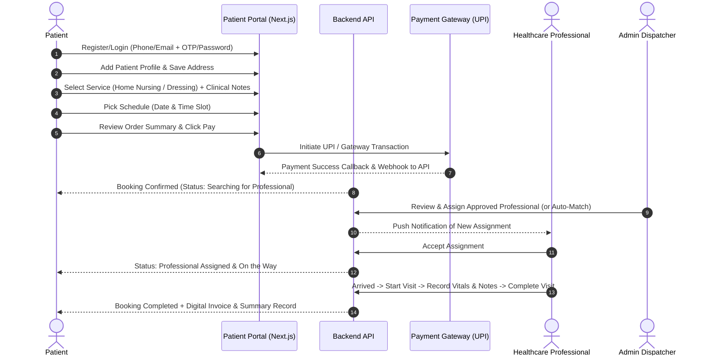
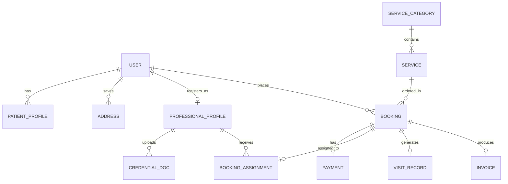

# 📘 Phase 1: MVP Product Requirement Specification (PRS)

**Target Version:** v1.0 (MVP)  
**Primary Goal:** Validate the end-to-end booking, payment, verified professional assignment, and home visit execution loop.

---

## 1. Phase 1 Scope & Core Services
* **Included Services:**
  1. **Home Nursing** (Vital checks, IV line setup, catheter care, post-op monitoring)
  2. **Wound Dressing & Care** (Post-surgical dressing, burn care, diabetic ulcer dressing)
* **Target Users:**
  * **Patients / Family Members** (Requestors)
  * **Healthcare Professionals** (Nurses & Verified Clinical Caregivers)
  * **Admins / Operations** (Credential Verifiers & Dispatchers)

---

## 2. User Roles & Detailed User Journeys

### 2.1. Patient & Family Member Portal

* **Key Features:**
  * **Auth & Profile:** Phone/Email authentication, profile creation with age, gender, medical history notes, and emergency contact.
  * **Multiple Patient Profiles:** Ability to maintain elderly parents, children, or self under one account.
  * **Address Management:** Multiple saved addresses with landmark, pincode, and GPS coordinates/location picker.
  * **Service Catalog & Booking Flow:** Browse services, view transparent price breakdown (base charge + material charge + taxes).
  * **UPI / Online Payment:** Instant checkout via UPI intent/QR/gateway; booking is created upon payment verification.
  * **Live Tracking & Status Timeline:**
    1. `Payment Confirmed`
    2. `Searching for Professional`
    3. `Professional Assigned`
    4. `Professional Accepted`
    5. `On the Way`
    6. `Arrived`
    7. `Service Started`
    8. `Service Completed`
    9. `Cancelled / Refunded`
  * **Visit Summary & Invoices:** View professional details, digital completion receipt, and payment tax invoice.

---

### 2.2. Healthcare Professional Portal (Web / Mobile PWA)
* **Registration & KYC Upload:**
  * Personal details: Full Name, Phone, Email, City, Service Radius (in km).
  * Professional qualifications: Nursing Degree/Diploma, Council Registration Number.
  * Document Upload: Government Photo ID (Aadhaar/Passport/DL), Nursing License/Council Certificate, Experience Certificates.
* **Verification State Machine:**
  * `Pending` ➔ `Under Review` ➔ `Approved` (Active for bookings) or `Rejected` (with feedback reason).
* **Availability Toggle:**
  * Status switcher: `Available`, `Busy`, `Offline`.
* **Assignment Management:**
  * Real-time notifications of new patient booking assignments.
  * Patient details view (Address, Contact, Medical notes, Specific care requirements).
  * Actions: `Accept Request`, `Reject Request`.
* **Visit Execution Workflow:**
  1. `Start Travel / On the Way` (with map navigation link).
  2. `Mark Arrived` at patient doorstep.
  3. `Start Visit` (Timer starts).
  4. `Record Clinical Vitals`: Blood Pressure (BP), Pulse/Heart Rate, Blood Sugar (RBS/FBS), SpO2, Temperature, Procedure Notes.
  5. `Complete Visit` (Confirmation code / digital sign-off).
* **Earnings & Service History:**
  * Completed visits list with payout breakdown and status.

---

### 2.3. Admin & Operations Portal
* **Dashboard Metrics:**
  * Total Active Bookings, Today's Scheduled Visits, Total Revenue, Active Professionals, Pending KYC Applications.
* **Professional Verification Desk:**
  * Review submitted documents, verify medical license validity, Approve or Reject with comments.
* **Dispatch & Booking Management:**
  * Live booking queue with real-time status.
  * Manual assignment / reassignment of professionals based on service type, locality, and availability.
* **Service & Pricing Catalog Management:**
  * Create/edit services (Base price, visiting fee, duration, description).
* **Payment & Transaction Logs:**
  * Complete transaction ledger, status reconciliation, manual refund trigger.
* **Audit & Activity Logs:**
  * Full audit trail for booking status changes, assignments, and verification decisions.

---

## 3. Data Model (Phase 1 MVP Entities)

### Core Schema Fields:
1. **User:** `id, name, email, phone, role (PATIENT | PROFESSIONAL | ADMIN), status, createdAt`
2. **PatientProfile:** `id, userId, fullName, age, gender, bloodGroup, medicalNotes, emergencyContact`
3. **Address:** `id, userId, label (Home/Work/Parents), addressLine1, addressLine2, landmark, city, pincode, lat, lng`
4. **ProfessionalProfile:** `id, userId, qualification, councilRegNumber, experienceYears, serviceRadiusKm, verificationStatus (PENDING | UNDER_REVIEW | APPROVED | REJECTED), availability (AVAILABLE | BUSY | OFFLINE), currentLat, currentLng`
5. **CredentialDoc:** `id, professionalId, docType (ID_PROOF | LICENSE_CERT | DEGREE), docUrl, status`
6. **Service:** `id, categoryId, name, slug, description, basePrice, estimatedDurationMin, isActive`
7. **Booking:** `id, bookingNumber, userId, patientProfileId, addressId, serviceId, scheduledDate, scheduledTimeSlot, clinicalInstructions, status (PENDING_PAYMENT | CONFIRMED | ASSIGNED | ON_THE_WAY | ARRIVED | IN_PROGRESS | COMPLETED | CANCELLED), totalAmount`
8. **Payment:** `id, bookingId, paymentGateway, gatewayOrderId, gatewayPaymentId, amount, status (PENDING | SUCCESS | FAILED | REFUNDED), method (UPI | CARD | NETBANKING)`
9. **BookingAssignment:** `id, bookingId, professionalId, assignedBy (AUTO | ADMIN), status (PENDING | ACCEPTED | REJECTED | REASSIGNED), assignedAt, respondedAt`
10. **VisitRecord:** `id, bookingId, professionalId, startedAt, completedAt, bpSystolic, bpDiastolic, pulse, temperature, spO2, bloodSugar, procedureNotes, patientSignoff`
11. **Invoice:** `id, bookingId, invoiceNumber, subtotal, taxAmount, discountAmount, totalPaid, issuedAt, pdfUrl`

---

## 4. Phase 1 API Endpoints Specification

| Method | Endpoint | Description | Auth Required |
| :--- | :--- | :--- | :--- |
| `POST` | `/api/auth/register` | Register User (Patient/Pro) | Public |
| `POST` | `/api/auth/login` | Login & JWT Session | Public |
| `GET/POST` | `/api/patient/profiles` | Get / Create Patient Profiles | Patient |
| `GET/POST` | `/api/patient/addresses` | Get / Create Saved Addresses | Patient |
| `GET` | `/api/services` | List active services & pricing | Public |
| `POST` | `/api/bookings` | Create draft booking | Patient |
| `POST` | `/api/payments/create-order` | Initiate Gateway/UPI Order | Patient |
| `POST` | `/api/payments/webhook` | Gateway payment webhook listener | Public (Signature Verified) |
| `GET` | `/api/bookings/:id/track` | Realtime booking status & professional info | Patient / Pro / Admin |
| `POST` | `/api/pro/credentials` | Upload KYC documents | Professional |
| `GET` | `/api/pro/assignments` | List incoming & active assignments | Professional |
| `PATCH` | `/api/pro/assignments/:id` | Accept / Reject assignment | Professional |
| `POST` | `/api/pro/visit/status` | Update visit status (On Way, Arrived, Start) | Professional |
| `POST` | `/api/pro/visit/complete` | Submit clinical vitals, notes & complete visit | Professional |
| `GET` | `/api/admin/verifications` | List pending professional verifications | Admin |
| `PATCH` | `/api/admin/verifications/:id` | Approve / Reject professional KYC | Admin |
| `POST` | `/api/admin/bookings/assign` | Manually assign/reassign professional | Admin |
| `GET` | `/api/invoices/:bookingId` | Download / View Invoice | Authenticated |

---

## 5. Phase 1 Acceptance Criteria & Verification Matrix
- [x] Patient can register, add family profile, select Home Nursing, and pay via UPI.
- [x] Booking is only marked `CONFIRMED` upon valid payment signature verification.
- [x] Professional cannot receive assignments unless their status is `APPROVED` by Admin.
- [x] Professional receives assignment, can navigate, record vitals, and complete the visit.
- [x] Patient and Admin screens receive immediate status transitions upon each step.
- [x] An itemized digital invoice is generated at completion.
