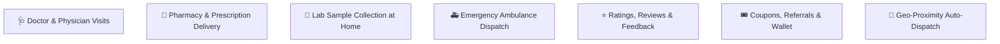
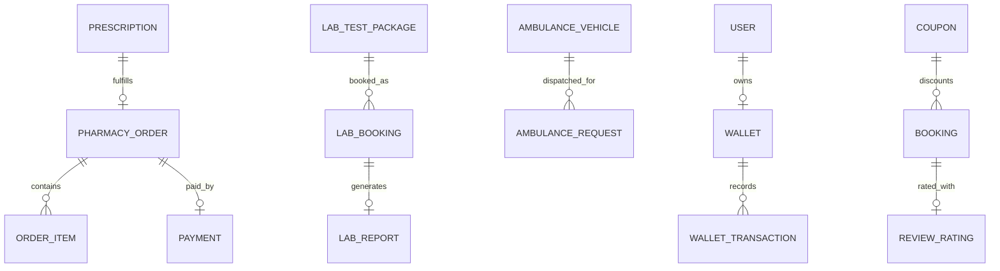

# 📙 Phase 2: Platform Expansion Product Requirement Specification (PRS)

**Target Version:** v2.0 (Expansion)  
**Primary Goal:** Expand clinical offerings (Doctor visits, Labs, Pharmacy, Ambulance), introduce automated matching, emergency triage, prescription validation, and rating/reward mechanisms.

---

## 1. Phase 2 Scope & New Modules

---

## 2. Detailed Functional Specifications

### 2.1. Doctor & Physician Assistant Home Visits
* **Specialist Consultation Selection:** General Physician, Geriatric Specialist, Pediatrician, Physiotherapist.
* **Pre-visit Clinical Intake:** Symptoms questionnaire, allergy declarations, current ongoing medication list.
* **Digital Prescription Generation:** During/after visit, the doctor creates a digitally signed prescription with dosage, frequency, and instructions.

### 2.2. Pharmacy & Prescription Ordering Module
* **Prescription Upload Flow:**
  1. Patient uploads prescription image/PDF.
  2. OCR + Pharmacist / Admin verification queue (`Pending Verification` ➔ `Verified` ➔ `Items Priced`).
  3. Patient receives priced cart notification and confirms checkout with UPI/Card.
* **Direct Medication Search & Catalog:**
  * OTC (Over-the-Counter) medications: Direct purchase without prescription.
  * Prescription-only (Rx) drugs: Requires validated prescription attachment.
* **Delivery & Fulfillment Tracking:**
  * Packed ➔ Picked Up ➔ Out for Delivery ➔ Delivered (with delivery agent tracking).

### 2.3. Lab Sample Collection (Diagnostics at Home)
* **Lab Package Catalog:** Blood tests, Lipid Profile, Thyroid, HbA1c, Full Body Checkups.
* **Phlebotomist Assignment:** Certified phlebotomist assigned with sterile collection kit.
* **Sample Barcode & Tracking:** Barcode scanning upon collection at patient home.
* **Report Delivery:** PDF Diagnostic report uploaded to patient portal once lab processing finishes; SMS/WhatsApp alert sent with secure download link.

### 2.4. Ambulance Booking & Emergency Dispatch Module
* **Urgency Priority Queue:** Real-time emergency handling bypassing standard scheduling.
* **Ambulance Type Selection:**
  * **Basic Life Support (BLS):** Oxygen cylinder, stretcher, first aid.
  * **Advanced Life Support (ALS):** Defibrillator, ventilator, paramedic onboard.
  * **Patient Transport Vehicle (PTV):** Routine non-emergency mobility.
* **Dispatch Workflow:**
  * Instant location lock (GPS auto-detection).
  * Nearest active ambulance auto-alerted.
  * Automated emergency contact SMS alert with live tracking URL.

### 2.5. Reviews, Ratings & Quality Control
* 5-star rating system + clinical feedback tags (e.g., "Punctual", "Gentle Care", "Professional").
* Healthcare professional rating score calculation (visible to patients during booking).
* Low rating (<3 stars) automatic escalation trigger to Operations support team.

### 2.6. Geolocation Auto-Assignment Engine
* Replaces purely manual admin dispatch with intelligent scoring algorithm:
  $$\text{Score} = w_1 \cdot (\text{Proximity Distance}) + w_2 \cdot (\text{Rating}) + w_3 \cdot (\text{Active Workload}) + w_4 \cdot (\text{Acceptance Rate})$$
* Falls back to Admin Manual Queue if no professional accepts within 180 seconds.

---

## 3. Data Model Additions (Phase 2 Entities)

### New Entities:
1. **Prescription:** `id, patientProfileId, doctorId, docUrl, isDigitallyCreated, status (PENDING_VERIFY | APPROVED | REJECTED), verifiedBy`
2. **PharmacyOrder:** `id, orderNumber, userId, prescriptionId, deliveryAddressId, status (PLACED | PROCESSING | DISPATCHED | DELIVERED | CANCELLED), totalAmount`
3. **LabBooking:** `id, patientProfileId, packageId, phlebotomistId, sampleBarcode, scheduledSlot, reportUrl, status`
4. **AmbulanceRequest:** `id, requestNumber, pickupLat, pickupLng, destinationAddress, ambulanceType (BLS | ALS | PTV), driverId, status (DISPATCHED | ON_SCENE | IN_TRANSIT | REACHED_HOSPITAL | COMPLETED)`
5. **ReviewRating:** `id, bookingId, professionalId, patientId, rating (1-5), feedbackText, tags, createdAt`
6. **Wallet & Coupon:** `id, userId, balance, points` & `id, couponCode, discountType, discountValue, minOrderValue, validUntil`

---

## 4. Phase 2 API Endpoints Specification

| Method | Endpoint | Description |
| :--- | :--- | :--- |
| `POST` | `/api/prescriptions/upload` | Upload user prescription for validation |
| `GET/POST` | `/api/pharmacy/orders` | Place & track pharmacy medication orders |
| `GET` | `/api/labs/packages` | List available laboratory test packages |
| `POST` | `/api/labs/book` | Book home sample collection slot |
| `POST` | `/api/ambulance/emergency-request` | Instant emergency ambulance dispatch |
| `GET` | `/api/ambulance/track/:id` | Live tracking telemetry for ambulance |
| `POST` | `/api/reviews` | Submit visit rating & feedback |
| `POST` | `/api/coupons/apply` | Validate and apply promo code |
| `GET` | `/api/wallet/balance` | Fetch user reward balance and transaction history |

---

## 5. Phase 2 Acceptance Criteria
- [x] Patients can upload prescriptions and receive an itemized cart for checkout.
- [x] Doctor visits generate clinical notes and downloadable digital Rx.
- [x] Emergency ambulance requests trigger high-priority push notifications and real-time dispatch within 30 seconds.
- [x] Phlebotomist can log sample barcode and system delivers lab PDF report to patient vault.
- [x] Auto-assignment engine successfully matches the nearest available professional within configured radius.
