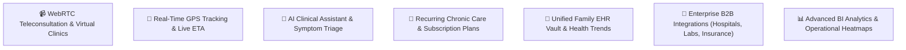
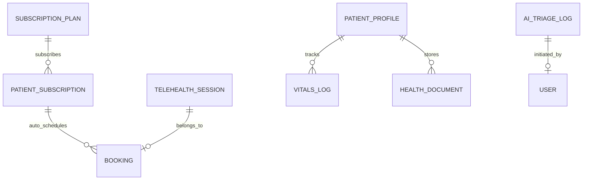

# 📕 Phase 3: Smart Ecosystem & AI Intelligence Product Requirement Specification (PRS)

**Target Version:** v3.0 (Advanced Ecosystem)  
**Primary Goal:** Transform into a comprehensive intelligent home care ecosystem featuring Teleconsultation, Live GPS Tracking, Recurring Chronic Care Subscriptions, AI Triage & Recommendation engine, and Enterprise B2B Integrations.

---

## 1. Phase 3 Scope & High-Value Capabilities

---

## 2. Detailed Functional Specifications

### 2.1. Live GPS Telemetry & Real-time Tracking
* **Live Professional Location Broadcast:** High-frequency WebSocket / MQTT connection streaming professional coordinates to the patient tracking screen when status is `On the Way`.
* **Dynamic ETA Engine:** Continuous recalculation of Arrival Time based on traffic APIs (Google Maps / Mapbox).
* **Geofencing Triggers:** Automatic state change to `Arrived` when the professional crosses a 50-meter geofence around the patient's delivery pin.

### 2.2. Teleconsultation (Video & Audio Virtual Clinic)
* **WebRTC Encrypted Video Calling:** High-definition, low-latency in-app audio/video consultation powered by LiveKit / Agora / Twilio.
* **In-Call Clinical Tools:**
  * Screen sharing for medical reports and radiology scans.
  * Real-time in-call chat and instant prescription drafting.
  * Integration to convert teleconsultation into an immediate follow-up home visit (e.g. nurse injection or blood test).

### 2.3. AI-Assisted Symptom Triage & Recommendations
* **Conversational AI Intake:**
  * Natural language symptom analysis (LLM-based guided prompt flow).
  * Red flag / emergency detection (e.g., chest pain, stroke symptoms ➔ immediate 1-click Ambulance redirect).
  * Automated service recommendation (e.g., recommends "Wound Dressing" vs "Doctor Visit" vs "Blood Panel").
* **AI Clinical Summary:** Generates structured SOAP notes (Subjective, Objective, Assessment, Plan) for visiting clinicians from patient audio/text inputs.

### 2.4. Recurring Care Plans & Subscription Memberships
* **Chronic Care Packages:**
  * Elderly Daily Care (daily vital monitoring + hygiene assistance).
  * Post-Stroke Rehabilitation (physiotherapy 3x/week + nurse checkup).
  * Diabetic Management (bi-weekly blood sugar + diet coaching).
* **Automated Recurring Billing:** Auto-debit via UPI Mandates / Subscription billing.
* **Care Plan Scheduler:** Automated roster generator matching patient recurring slots with dedicated primary caregivers.

### 2.5. Unified Family EHR Vault & Vitals Trends
* **Health Dashboard:** Visual charts for Blood Pressure, Blood Sugar (HbA1c), SpO2, and Weight over time.
* **Unified Records:** Centralized repository for hospital discharge summaries, lab PDFs, digital prescriptions, and vaccination records.
* **Multi-Family Sharing:** Granular permission controls allowing NRI / remote family members to monitor elderly parents' health metrics in real-time.

### 2.6. Enterprise B2B Integrations
* **Hospital HIS/EMR Integration (HL7 / FHIR APIs):** Direct sync of discharge notes and post-discharge home care bookings.
* **3rd-Party Lab LIS Sync:** Direct bidirectional order and PDF report transmission.
* **Cashless Insurance & TPA Claims:** Digital receipt and pre-formatted claim submission generation.

---

## 3. Data Model Additions (Phase 3 Entities)

### New Entities:
1. **TelehealthSession:** `id, bookingId, doctorId, patientProfileId, roomSid, startedAt, endedAt, recordingUrl, consultationNotes`
2. **SubscriptionPlan:** `id, name, tier, serviceBundleJson, frequencyPerWeek, monthlyPrice, isActive`
3. **PatientSubscription:** `id, patientProfileId, planId, status (ACTIVE | PAUSED | CANCELLED), startDate, nextBillingDate, upiMandateId`
4. **VitalsLog:** `id, patientProfileId, recordedAt, systolic, diastolic, pulse, spo2, glucose, source (MANUAL | PRO_VISIT | IOT_DEVICE)`
5. **HealthDocument:** `id, patientProfileId, category (DISCHARGE_SUMMARY | LAB_REPORT | PRESCRIPTION | RADIOLOGY), fileUrl, tags, uploadedBy`
6. **AITriageLog:** `id, userId, inputSymptoms, detectedUrgencyLevel (LOW | MEDIUM | CRITICAL_EMERGENCY), recommendedServicesJson, convertedToBookingId`

---

## 4. Phase 3 API Endpoints Specification

| Method | Endpoint | Description |
| :--- | :--- | :--- |
| `POST` | `/api/telehealth/rooms/create` | Provision secure WebRTC consultation room |
| `GET/POST` | `/api/telehealth/session/:id/notes` | Realtime in-call clinical note synchronization |
| `POST` | `/api/ai/triage` | Process symptoms and return triage recommendations |
| `GET/POST` | `/api/subscriptions/plans` | Manage and subscribe to recurring care plans |
| `POST` | `/api/subscriptions/mandate/setup` | Register recurring UPI mandate for automated billing |
| `GET/POST` | `/api/ehr/vitals-history` | Query time-series biometric charts & logs |
| `POST` | `/api/ehr/vault/upload` | Secure encrypted upload to digital health vault |
| `GET` | `/api/admin/analytics/heatmaps` | Geographic service demand and professional distribution |

---

## 5. Phase 3 Acceptance Criteria
- [x] End-to-end WebRTC teleconsultation operates with secure media streams and live prescription generation.
- [x] Patient tracking map displays smooth 60fps real-time vehicle movement and accurate ETA calculations.
- [x] Recurring subscriptions automatically generate and assign weekly bookings according to scheduled recurring slots.
- [x] AI Triage successfully classifies critical emergencies and offers relevant service matching.
- [x] Family health vault graphs biometric data trends over time across multiple care visits.
