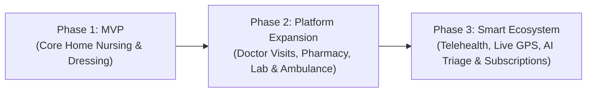

# 📌 Home Healthcare Platform – Requirements Roadmap & Phasing Overview

## 🎯 Executive Summary
The **Home Healthcare Platform** is an on-demand, multi-sided marketplace connecting **Patients & Family Members** with **Verified Healthcare Professionals** (Doctors, Nurses, Physician Assistants, Lab Techs) for doorstep clinical and home care services, monitored by an **Admin & Operations Team**.

To ensure rapid time-to-market, risk mitigation, and scalable software architecture, the platform development is partitioned into **3 structured phases**:

---

## 🗺️ Phases Summary Table

| Phase | Strategic Focus | Target Services | Key Modules & Portals | Tech Milestones |
| :--- | :--- | :--- | :--- | :--- |
| **[Phase 1 (MVP)](file:///c:/Users/sanja/web_projects/homedigo/docs/Phase_1_MVP_Requirements.md)** | Core transactional loop & compliance verification | • Home Nursing • Wound Dressing / Care | • Patient Portal (Booking & Tracking) • Professional Portal (KYC & Visit Workflow) • Admin Portal (Verification & Dispatch) • UPI Payment & Invoicing | Next.js Full-Stack, PostgreSQL + Prisma, Auth (RBAC), Payment Gateway Webhooks |
| **[Phase 2 (Expansion)](file:///c:/Users/sanja/web_projects/homedigo/docs/Phase_2_Expansion_Requirements.md)** | Service diversity & emergency services | • Doctor Home Visits • Physician Assistant • Pharmacy / Prescription Delivery • Lab Sample Collection • Ambulance Dispatch | • Prescription Verification Engine • Pharmacy Order Manager • Ambulance Emergency Queue • Reviews & Ratings • Coupons & Wallet System | Cloud Object Storage, Geolocation auto-matching, PDF Prescription parser, SMS/WhatsApp alerts |
| **[Phase 3 (Ecosystem)](file:///c:/Users/sanja/web_projects/homedigo/docs/Phase_3_Advanced_Ecosystem_Requirements.md)** | Automation, Telehealth & AI Intelligence | • Teleconsultations • Recurring Chronic Care • Digital Care Plans • B2B Integrations | • WebRTC Video/Audio Clinic • Live GPS Telemetry / Realtime tracking • AI Symptom Triage & Recommendations • Family Health Record Vault • Advanced BI Analytics | WebRTC/Agora, Redis Pub/Sub, Live WebSockets, AI/LLM Care Assistant, External Partner APIs |

---

## 📂 Phase Requirement Documents Index
- 📘 **Phase 1 Document:** [Phase_1_MVP_Requirements.md](file:///c:/Users/sanja/web_projects/homedigo/docs/Phase_1_MVP_Requirements.md)
- 📙 **Phase 2 Document:** [Phase_2_Expansion_Requirements.md](file:///c:/Users/sanja/web_projects/homedigo/docs/Phase_2_Expansion_Requirements.md)
- 📕 **Phase 3 Document:** [Phase_3_Advanced_Ecosystem_Requirements.md](file:///c:/Users/sanja/web_projects/homedigo/docs/Phase_3_Advanced_Ecosystem_Requirements.md)
