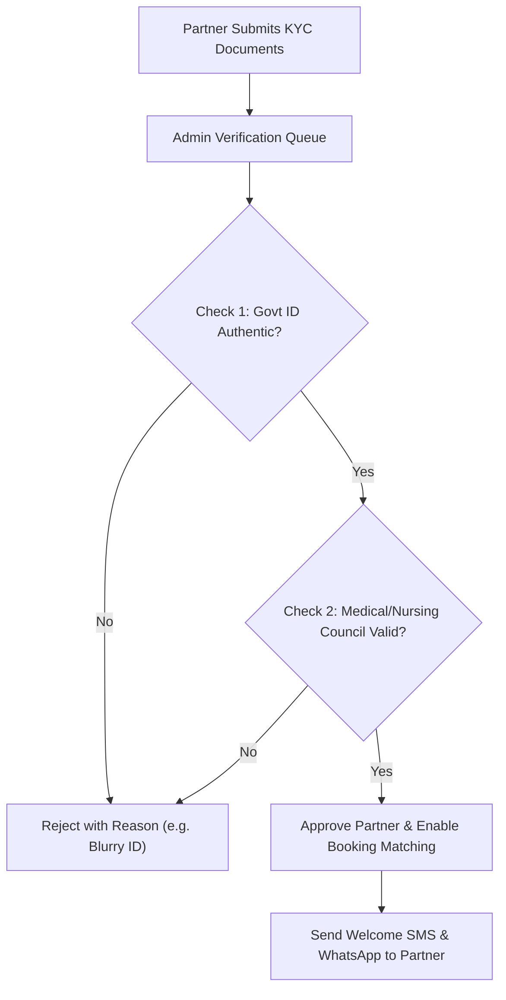
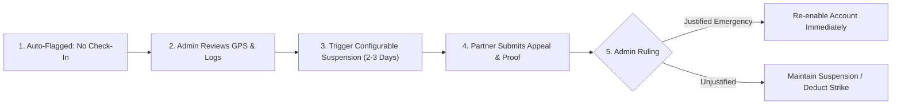

# 🛡️ Role Specification: Administrator & Operations Team

**Role Identifier:** `ADMIN` / `OPERATIONS`  
**Portal Name:** Admin Web Portal  
**Tagline:** *Oversee. Ensure Quality. Maintain Platform.*

---

## 1. Role Overview & Objective
The Administrator & Operations role is the mission-control center of HomeDigo. It empowers the internal operations team to verify healthcare professional credentials, oversee live booking dispatches, enforce quality & no-show governance, manage pricing and service catalogs, process refunds, and monitor real-time financial and clinical metrics.

---

## 2. Key Capabilities & Permissions

| Feature Module | Capabilities | Permission Level |
| :--- | :--- | :--- |
| **Operations Dashboard** | Real-time platform KPI metrics (Total Bookings, Active Partners, Revenue, Completion Rate) | Global Read |
| **Partner KYC Verification** | Inspect uploaded nursing/medical degrees, council registration validity, Approve or Reject | Full Control |
| **Dispatch & Reassignment** | Live booking monitor, manually assign or reassign professionals based on distance & workload | Full Control |
| **No-Show Governance** | Review automated no-show flags, enforce 2-3 day suspensions, evaluate partner appeals | Full Control |
| **Service Catalog & Pricing** | Add/edit services, set visiting charges, configure platform commission percentages | Full Control |
| **Payments & Refunds** | Monitor UPI transaction logs, issue full/partial refunds, approve partner payout batches | Full Control |
| **Pharmacy & Labs Desk** | Verify uploaded customer prescriptions, assign phlebotomists for blood collection | Full Control |
| **Emergency Ambulance** | Monitor real-time emergency dispatch queue and priority escalation | Priority Read/Write |
| **Audit Logs & Compliance** | View tamper-evident logs for all user logins, booking status changes, and admin decisions | Read-Only Audit |

---

## 3. Core Administrative Workflows

### 3.1. Healthcare Partner Verification Desk


---

### 3.2. Live Booking Dispatch & Intervention Engine
* **Real-time Map & Queue:** View all active bookings categorized by state:
  * `Searching for Partner` (Auto-dispatch timer running)
  * `Assigned` (Awaiting partner confirmation)
  * `On the Way` (Live GPS telemetry)
  * `In Progress` (Visit currently ongoing at patient location)
* **One-Click Reassignment:** If a partner rejects or is delayed, admin can manually select from a list of nearby available partners sorted by proximity and performance score.

---

### 3.3. No-Show & Quality Enforcement Console


---

### 3.4. Financial Ledger & Payout Approval
* **Patient Transactions:** Search and inspect every UPI transaction ID, bank reference number (RRN), and gateway webhook response.
* **Partner Payout Batches:** Weekly automated calculation of partner earnings minus platform commission, with 1-click batch bank disbursement.
* **Instant Refunds:** Trigger partial or 100% UPI refunds with instant ledger reconciliation for cancelled or delayed visits.

---

## 4. UI Screen Inventory (Admin Portal)

```
/admin
├── /dashboard               # Operations overview (Total bookings, active partners, revenue charts)
├── /bookings                # Live booking queue, status filters, reassignment modal
├── /partner-verification   # KYC review queue (Document viewer, approval/rejection notes)
├── /partner-management     # Directory of all registered doctors, nurses, and specialists
├── /no-show-review          # Flagged no-show incidents, suspension controls, appeal review
├── /services-and-pricing    # Create/edit service categories, base fees, durations, commission %
├── /payments-and-refunds    # UPI transaction logs, refund management, partner payout ledger
├── /pharmacy-orders         # Prescription validation queue & medicine delivery dispatch
├── /ambulance-monitoring    # Emergency ambulance real-time tracking desk
├── /audit-logs              # Comprehensive system audit logs & security telemetry
└── /settings                # Platform configurations, notification templates, SLA timers
```
