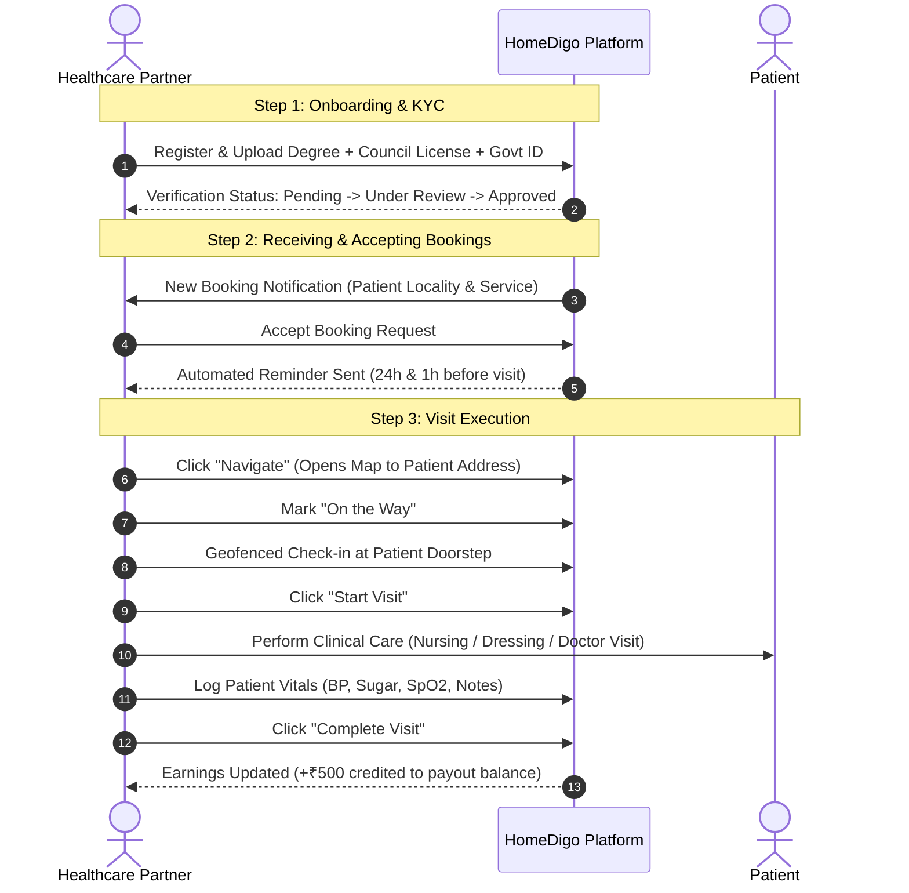
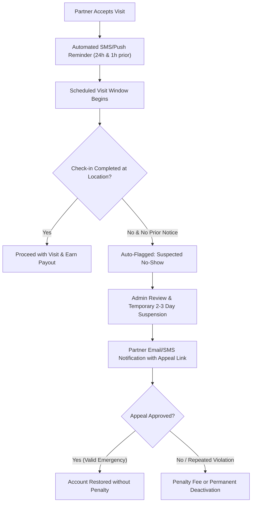

# 🩺 Role Specification: Healthcare Partner (Professional)

**Role Identifier:** `PARTNER` / `PROFESSIONAL`  
**Portal Name:** Healthcare Partner Web Portal (PWA Ready)  
**Tagline:** *Manage Schedule. Serve Patients. Earn.*

---

## 1. Role Overview & Objective
The Healthcare Partner role is tailored for verified medical and clinical professionals—including **Doctors, Registered Nurses, Physician Assistants, Physiotherapists, and Phlebotomists**. It provides them with an operational dashboard to manage their clinical schedule, accept service requests within their geographical radius, navigate to patient doorsteps, log clinical vitals, and track their payouts.

---

## 2. Key Capabilities & Permissions

| Feature Module | Capabilities | Permission Level |
| :--- | :--- | :--- |
| **KYC & Credential Upload** | Submit Nursing/Medical degrees, State Medical/Nursing Council licenses, Govt ID | Create & Update |
| **Availability Management** | Toggle status (`Available`, `Busy`, `Offline`), set working hours & service radius (e.g. 10 km) | Update Own Status |
| **Request Management** | Receive booking alerts, review patient clinical instructions, Accept or Reject requests | Assigned Requests |
| **Visit Execution** | GPS Turn-by-Turn Navigation, Location Geofenced Check-in, Start/End Timer | Active Booking |
| **Clinical Logging** | Record vital biometrics (BP, Pulse, Blood Sugar, SpO2, Temperature) & treatment notes | Active Booking |
| **Earnings & Ledger** | View daily/weekly completed visit earnings, per-visit payout breakdown, bank account details | Own Financials |
| **No-Show / Compliance** | View account standing, dispute/appeal suspected no-show violations | Own Account Only |

---

## 3. End-to-End Partner Journey



---

## 4. 🛡️ Compliance & No-Show Policy Integration

To guarantee quality of care for patients, partners are governed by the **11-Step No-Show & Quality Engine**:



* **Grace Period & Rescheduling:** Partners must cancel at least **2 hours prior** with a valid reason to avoid no-show strikes.
* **Geofenced Check-In:** Partner must be within **100 meters** of the patient's registered coordinates to register arrival.

---

## 5. UI Screen Inventory (Partner Portal)

```
/partner
├── /dashboard               # Today's Overview (Upcoming Visits, Completed, Today's Earnings)
├── /my-availability         # Active status toggle (Available/Offline), Service Radius (km)
├── /bookings                # Active, Upcoming, and Completed clinical visits
├── /bookings/:id/visit      # Live Visit Cockpit (Patient info, Navigate, Vitals Form, Complete)
├── /earnings                # Total Revenue, Payouts history, Bank account setup
├── /verification-status     # KYC document upload and approval status
├── /appeals-and-support     # Account standing, No-Show review appeals, Support tickets
└── /profile                 # Qualifications, Specializations, Experience, Contact info
```
