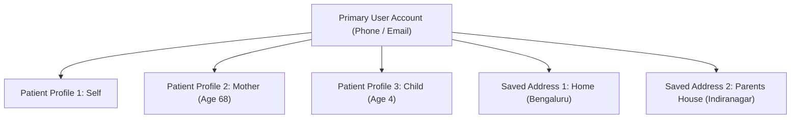
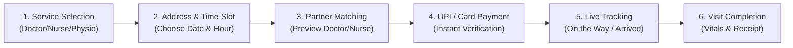

# 👤 Role Specification: Patient & Family Member

**Role Identifier:** `PATIENT`  
**Portal Name:** Patient Web Portal  
**Tagline:** *Book. Pay. Track. Stay Informed.*

---

## 1. Role Overview & Objective
The Patient role allows individuals and family caregivers to search for trusted healthcare services at home, schedule visits for themselves or dependents, complete secure UPI payments, track visiting professionals in real-time, and access digital medical records, prescriptions, and invoices.

---

## 2. Key Capabilities & Permissions

| Feature Module | Capabilities | Permission Level |
| :--- | :--- | :--- |
| **Authentication & Profile** | Mobile/Email OTP Login, Edit Profile, Manage Family Members | Own Account Only |
| **Address Management** | Save multiple addresses (Home, Office, Elderly Parents) with GPS pins | Own Account Only |
| **Service Booking** | Browse categories, select time slots, clinical details, pay via UPI | Read & Create |
| **Live Tracking** | Real-time status updates (`Assigned` ➔ `On the Way` ➔ `Arrived` ➔ `In-Progress`) | Assigned Bookings Only |
| **Medical Records & Invoices** | Download digital prescriptions, vitals log, and GST tax invoices | Own Records Only |
| **Pharmacy & Labs** | Upload Rx, order medications, book at-home blood tests | Read & Create |
| **Emergency Ambulance** | 1-Click emergency request with live GPS vehicle dispatch | Read & Create |
| **Feedback & Ratings** | Rate partners (1-5 stars) and write clinical visit reviews | Completed Bookings Only |

---

## 3. Detailed User Workflows

### 3.1. Family Account & Multi-Profile Management
* A single user account can create and manage multiple patient profiles:
  * **Self** (Primary Account Holder)
  * **Elderly Parents** (Includes chronic history, mobility status)
  * **Children / Spouse**
* Stored clinical attributes per profile: Age, Gender, Blood Group, Known Allergies, Ongoing Medications, Emergency Contact Number.



---

### 3.2. The 6-Step Booking & Payment Flow


1. **Step 1: Service Selection**
   * Select required care: Doctor Visit, Home Nursing, Wound Dressing, Physiotherapy, Lab Test, etc.
   * Enter specific clinical instructions (e.g., "Post-knee surgery dressing change").
2. **Step 2: Address & Schedule**
   * Pick from saved addresses or pin new location on map.
   * Select preferred date and available 1-hour time window.
3. **Step 3: Partner Preview**
   * Preview matched certified partner details: Full Name, Qualification, Experience, Star Rating (e.g., ⭐ 4.8 / 124 visits), Profile Photo.
4. **Step 4: Secure Payment**
   * Transparent price breakdown: Base Fee + Material Cost + Applicable Taxes.
   * 1-Click UPI Payment (Google Pay, PhonePe, Paytm, QR) or Credit/Debit Card via secure gateway.
5. **Step 5: Live Visit Tracking**
   * Real-time status badge: `Payment Confirmed` ➔ `Assigned` ➔ `On the Way` (Live Map ETA) ➔ `Arrived` ➔ `In Progress`.
6. **Step 6: Completion & Digital Record**
   * Professional logs vitals (Blood Pressure, Sugar, Pulse, SpO2, Temperature).
   * Patient views visit summary, downloads PDF invoice, and submits rating & review.

---

## 4. UI Screen Inventory (Patient Portal)

```
/patient
├── /dashboard               # Active bookings, recent visits, quick rebook shortcuts
├── /book-service            # 6-Step interactive booking wizard
├── /my-appointments         # Scheduled, In-Progress, and Past visits
├── /appointments/:id        # Live tracking map, assigned partner info & contact
├── /family-profiles         # Add/edit family member health profiles
├── /addresses               # Manage saved home/work locations
├── /pharmacy                # Prescription upload & medicine orders
├── /lab-tests               # Browse diagnostic packages & book blood tests
├── /invoices                # Billing history & downloadable tax invoices
└── /profile-settings        # Account details, notifications, emergency contacts
```
